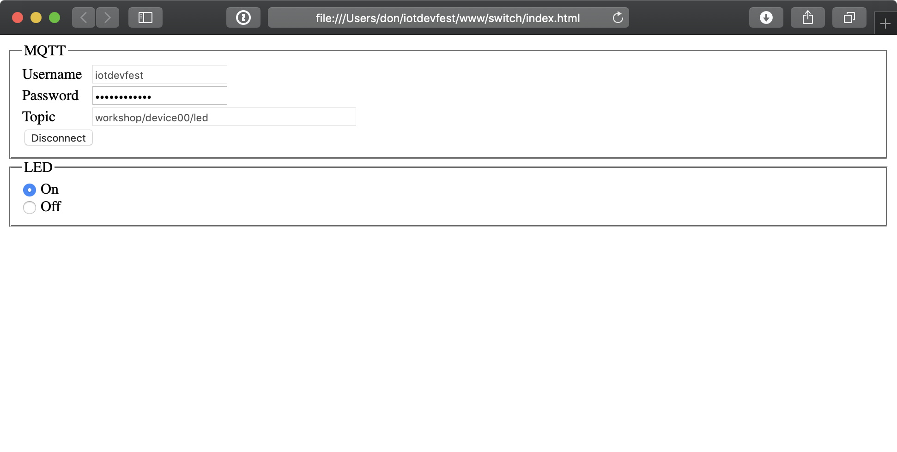

# Exercise 6: Sending Data to Arduino

In the previous examples, the Arduino published data using MQTT messages. The Arduino can also subscribe to a MQTT topic.

1. Open arduino/LED/LED.ino in the Arduino IDE
1. Update WiFi ssid and password
1. Change the clientId to match your device id
1. Change the username to match your device id
1. Change the MQTT password
1. Deploy the code the Arduino _Sketch -> Upload_
1. Open the serial monitor _Tools -> Serial Monitor_

The Arduino should now be connected to the network and waiting for MQTT messages.

1. Open www/switch/index.html in a text editor
1. Update the `<input>` default form values for userId, password, and topic so they match your device
1. Open www/switch/index.html in your web browser
1. Press connect
1. Use the radio buttons to control the LED on your Arduino

The Arduino can publish and subscribe to MQTT messages at the same time. The [TemperatureHumidityLED sketch](/arduino/TemperatureHumidityLED/TemperatureHumidityLED.ino) demonstrates the Arduino publishing messages to temperature and humidity topics, while subscribing to the LED topic.

Next [Exercise 7: Connecting using X.509 certs](exercise7.md)
